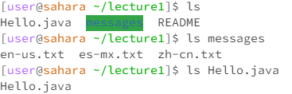
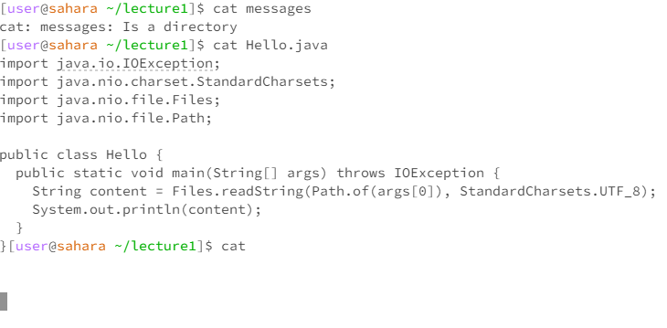

## Examples with cd

1. Now the working directory is "home". When put no arguments after 'cd', it appears and changes nothing. I believe it is not an error. but because I give cd no directory, it just stays where it is.
2. Now the working directory is still "home." When I put directory "lecture1" after cd, the path showing the next line in the terminal changes to "[user@sahara ~/lecture1]" showing the working directory changed to lecture 1. Thus, it is not an error.
3. Now the working directory is "lecture1", when I put the file "Hello.java" after cd, it reports an error that "bash: cd: Hello.java: Not a directory" because Hello.java is not a directory that it is not possible to be a working directory

## Examples with ls

1. The working directory here is "lecture1". When I run ls in the command, it simply shows all the files and folders in "lecture1". Thus, it is not an error.
2. The working directory is "lecture1". When I run ls with the directory "messages," it shows all the files inside of "messages." It is not an error.
3. The working directory is "lecture1". When I run ls with file "Hello.java," it just repeats the file name "Hello.java" because there is no file "inside" of "Hello.java," and it just simply repeats the file name. It is not an error. 

## Examples with cat

**I did the last 2 questions first**
2. The working directory here is "lecture1". When I run cat with directory "messages," it shows an error saying, "cat: messages: Is a directory." This is because the cat is used to "catenate" and show the exact content in a file. However, the directory "messages" contains more files instead of the exact content that can be shown. Thus, it becomes an error.
3. The working directory here is "lecture1". When I run cat with the file "Hello.java," it reads the file and prints the code to the terminal. Thus, it is not an error.
1. The working directory here is "lecture1". When I run cat with no argument, it appears nothing and didn't end the conversation. It is not an error, but the terminal will just repeat what you type in.

## picture
