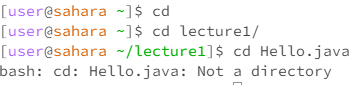
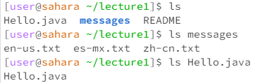
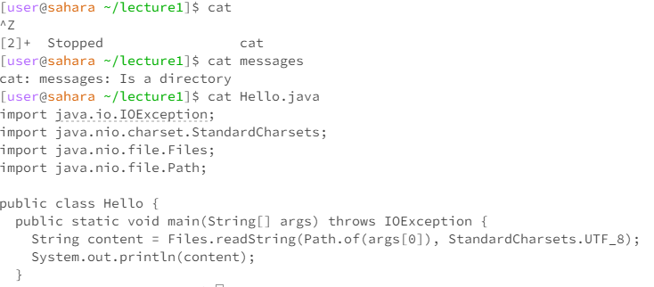

# Examples with cd



## cd with no argument
input:
```
[user@sahara ~]$ cd
```
output:
```
[user@sahara ~]$
```
* Now the working directory is "home".
* When I put no arguments after ` cd `, it  changes nothing, and the working directory shown in the next line of the terminal is still /home. I have this output because I put no path after ` cd ` which tells the filesystem to stay where it is.
* It is not an error.

___
## cd with a path to a directory

input:
```
[user@sahara ~]$ cd lecture1/
```
output:
```
[user@sahara ~/lecture1]$
```
* Now the working directory is still "home."
* When I put directory "lecture1" after `cd`, the path showing the next line in the terminal changes to `[user@sahara ~/lecture1]` showing the working directory changed to lecture 1. I have this output because `cd` has moved my working directory from /home to /lecture1 by executing the path I put after `cd`.
* Thus, it is not an error.

___
## cd with a path to a file 

input:
```
[user@sahara ~/lecture1]$ cd Hello.java
```
output:
```
bash: cd: Hello.java: Not a directory
```

* Now the working directory is "lecture1".
* When I put the file "Hello.java" after `cd`, it reports an **error** that `bash: cd: Hello.java: Not a directory` because Hello.java is not a directory that it is not possible to be used as a working directory.
* It is an error.


## Examples with ls



input:
```
[user@sahara ~/lecture1]$ ls
```
output:
```
Hello.java  messages  README
```
1. The working directory here is "lecture1". When I run `ls` in the command, it simply shows all the files and folders in "lecture1". I get this output because `ls` lists all the files and folders in the current working directory when I put no argument after it. Thus, it is not an error.

input:
```
[user@sahara ~/lecture1]$ ls messages
```
output:
```
en-us.txt  es-mx.txt  zh-cn.txt
```
2. The working directory is "lecture1". When I run `ls` with the directory "messages," it shows all the files inside of "messages." I get this output because `ls` lists all the files and folders in the given path which is "messages." Thus, it is not an error.

input:
```
[user@sahara ~/lecture1]$ ls Hello.java
```
output:
```
Hello.java
```
3. The working directory is "lecture1". When I run `ls` with file "Hello.java," it just repeats the file name "Hello.java" I get this output because there is no file "inside" of "Hello.java," and it just simply repeats the file name. It is not an error. 


## Examples with cat



input:
```
[user@sahara ~/lecture1]$ cat
```
output:
```
```
1. The working directory here is "lecture1". When I run `cat` with no argument, it appears to be nothing and doesn't end the conversation. I get this output is because I tell the filesystem nothing to print since I put no argument after `cat`. It is not an error, but the terminal will just repeat what you type in.

input：
```
[user@sahara ~/lecture1]$ cat messages
```
output:
```
cat: messages: Is a directory
```
2. The working directory here is "lecture1". When I run `cat` with directory "messages," it shows an error saying, "cat: messages: Is a directory." I got this output because  `cat` is used to "catenate" and show the exact content in a file. However, the directory "messages" contains more files instead of the exact content that can be shown. Thus, it becomes an **error**.

input:
```
[user@sahara ~/lecture1]$ cat Hello.java
```
output:
```
import java.io.IOException;
import java.nio.charset.StandardCharsets;
import java.nio.file.Files;
import java.nio.file.Path;

public class Hello {
  public static void main(String[] args) throws IOException {
    String content = Files.readString(Path.of(args[0]), StandardCharsets.UTF_8);    
    System.out.println(content);
  }
```
3. The working directory here is "lecture1". When I run `cat` with the file "Hello.java," it reads the file and prints the code to the terminal. I get this output because `cat` reads the file Hello.java, which is the path I put as an argument. Thus, it is not an error.

